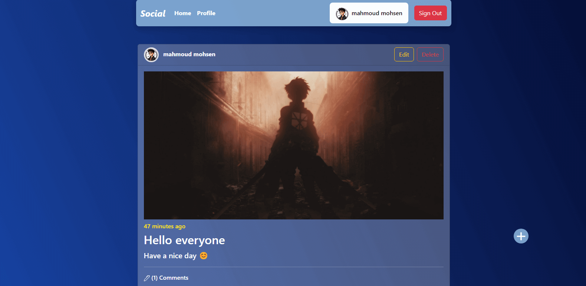

# Social App 📱

> The "Social App" is a dynamic web platform enabling users to connect, create, and engage with posts, comments, and profile information through a user-friendly interface.

</img>

## Try it Live!

Check out the live app [social-app](https://mahmoud-mohsen-dev.github.io/social-media-app/)

## How to Use

1. **Sign Up:**

    - Provide your `name`, `email`, `password`, and an `image`. All of these inputs are `required`. The app will automatically redirect you to the home page and sign you in.

2. **Create Your First Post:**

    - After signing in, the app will display a `plus sign` to indicate that you can create a post. Add a `title`, `post text`, and a `photo`.

3. **Comment on Others' Posts:**

    - Click on any post, and the app will redirect you to another page where you can find `comments` at the bottom of the post.

4. **Delete a Post:**

    - On the top right corner, click on the delete button. Note that you can only delete your own posts.

5. **Edit a Post:**

    - On the top right corner, click on the edit button. You can only edit your own posts.

6. **See Profile Info:**
    - View your own profile info by clicking on the `profile` tab.
    - See other people's info by clicking on the `avatar photo` on the top left of each post.

## Features

-   View other people's posts in guest mode, but you can't comment on them or add a post.

-   Sign in , up and out each with it's own request to the api
-   Create , update and delete posts and comment to other pople posts
-   View and update profile info
-   See other people profile info (their `user_name` ,`avatar photo` and `email`. Counts the `comments` and `posts` they published)

## Challenges

Dealing with promises and when to update the data was a challange for me. And what method to use to get what i want from the api.

**How i tackled this challenge**

1. Read the documentation of tarmeez api to understand what method to use like (get, post, update, patch, delete).
2. Reviewing the concepts of promises to better deal with fetching data or any asyncronize operations.

## Tools Used

-   JavaScript
-   Bootstrap
-   HTML
-   Axios
-   Tarmeez API
-   Postman

## Getting Started

1. Clone this repository.

    ```bash
    git clone https://github.com/mahmoud-mohsen-dev/social-media-app.git
    ```

2. Navigate to the Project Directory:
    ```bash
    cd social-media-app
    ```
3. Install Dependencies:

    ```bash
     npm install
    ```

4. Launch the project with live server or just open it in your browser.

_Now you have the "social" app up and running on your local machine._
